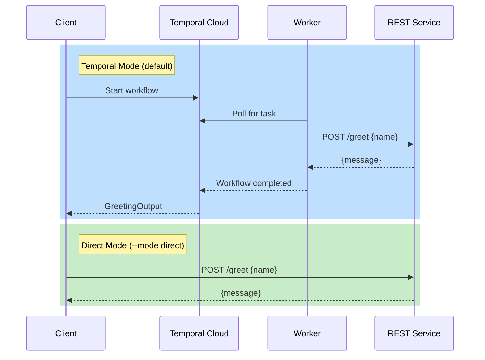

# TemporalGreeting

A .NET 9.0 sample demonstrating a swappable Temporal layer. The client can either go through Temporal — gaining durability, retries, and observability — or call the REST service directly, bypassing Temporal entirely. A single namespace, no Nexus.

## Architecture



## Prerequisites

- [.NET 9.0 SDK](https://dotnet.microsoft.com/download/dotnet/9.0)
- [Temporal CLI](https://docs.temporal.io/cli) (for local development)
- A [Temporal Cloud](https://cloud.temporal.io) account (for cloud deployment)

## Quick Start — Local Development

No configuration changes needed. The defaults in `appsettings.json` work out of the box with the local dev server.

1. **Clone and build**

   ```bash
   git clone <repo-url>
   cd api-temporal-shim
   dotnet build TemporalGreeting.sln
   ```

2. **Start Temporal dev server**

   ```bash
   temporal server start-dev
   ```

3. **Start REST service** (terminal 1)

   ```bash
   dotnet run --project src/TemporalGreeting.RestService
   ```

4. **Start Worker** (terminal 2)

   ```bash
   dotnet run --project src/TemporalGreeting.Worker
   ```

5. **Run client — Temporal mode** (terminal 3)

   ```bash
   dotnet run --project src/TemporalGreeting.Client -- "Alice"
   ```

6. **Run client — Direct mode** (skips Temporal, calls REST service directly)

   ```bash
   dotnet run --project src/TemporalGreeting.Client -- --mode direct "Alice"
   ```

## Connecting to Temporal Cloud

When targeting Temporal Cloud, you do **not** need the local dev server. The Worker and Client both need to be configured to point at your cloud endpoint. You can authenticate with either an API key or mTLS certificates.

### Option A: API Key

> **Important:** API key authentication requires a **regional endpoint**, not the namespace endpoint used by mTLS. The format is `<region>.<cloud_provider>.api.temporal.io:7233` (e.g. `us-west-2.aws.api.temporal.io:7233`). You can find your regional endpoint on the Namespaces page in the [Temporal Cloud UI](https://cloud.temporal.io). See the [Temporal docs on accessing namespaces](https://docs.temporal.io/cloud/namespaces#access-namespaces) for details on which endpoint to use.

Edit `appsettings.json` in both the Worker and Client projects:

```json
{
  "Temporal": {
    "Address": "us-west-2.aws.api.temporal.io:7233",
    "ApiKey": "your-api-key",
    "Namespace": "your-namespace.your-account"
  }
}
```

Or use environment variables:

```bash
export Temporal__Address="us-west-2.aws.api.temporal.io:7233"
export Temporal__ApiKey="your-api-key"
export Temporal__Namespace="your-namespace.your-account"
```

### Option B: mTLS Certificates

mTLS authentication uses the **namespace endpoint** (`<namespace>.<account>.tmprl.cloud:7233`).

Edit `appsettings.json` in both the Worker and Client projects:

```json
{
  "Temporal": {
    "Address": "your-namespace.your-account.tmprl.cloud:7233",
    "TlsCertPath": "/path/to/client.pem",
    "TlsKeyPath": "/path/to/client.key",
    "Namespace": "your-namespace.your-account"
  }
}
```

Or use environment variables:

```bash
export Temporal__Address="your-namespace.your-account.tmprl.cloud:7233"
export Temporal__TlsCertPath="/path/to/client.pem"
export Temporal__TlsKeyPath="/path/to/client.key"
export Temporal__Namespace="your-namespace.your-account"
```

### Running with Temporal Cloud

Once configured, the steps are the same as local development — just skip starting the dev server:

1. **Start REST service** (terminal 1)

   ```bash
   dotnet run --project src/TemporalGreeting.RestService
   ```

2. **Start Worker** (terminal 2)

   ```bash
   dotnet run --project src/TemporalGreeting.Worker
   ```

3. **Run client** (terminal 3)

   ```bash
   dotnet run --project src/TemporalGreeting.Client -- "Alice"
   ```

## Project Structure

```
api-temporal-shim/
├── TemporalGreeting.sln
├── src/
│   ├── TemporalGreeting.Contracts/      # Shared DTOs, config, and connection factory
│   ├── TemporalGreeting.RestService/    # ASP.NET Minimal API (port 5050) — POST /greet
│   ├── TemporalGreeting.Worker/         # Temporal worker: workflow + activity
│   └── TemporalGreeting.Client/         # Console client (--mode temporal|direct)
```

**Dependency graph:** Contracts <- Worker, Client. RestService has zero project references.

## Configuration Reference

Settings are loaded from `appsettings.json` (in the Worker and Client project directories) with environment variable overrides.

| Setting | Env Variable | Default | Description |
|---|---|---|---|
| `Temporal:Address` | `Temporal__Address` | `localhost:7233` | Temporal server gRPC endpoint |
| `Temporal:ApiKey` | `Temporal__ApiKey` | *(unset)* | API key for Temporal Cloud (enables TLS) |
| `Temporal:TlsCertPath` | `Temporal__TlsCertPath` | *(unset)* | Path to PEM client certificate (mTLS) |
| `Temporal:TlsKeyPath` | `Temporal__TlsKeyPath` | *(unset)* | Path to PEM client private key (mTLS) |
| `Temporal:Namespace` | `Temporal__Namespace` | `default` | Temporal namespace |
| `Temporal:TaskQueue` | `Temporal__TaskQueue` | `greeting-task-queue` | Worker task queue |
| `RestServiceUrl` | `RestServiceUrl` | `http://localhost:5050` | Base URL of the REST greeting service |
